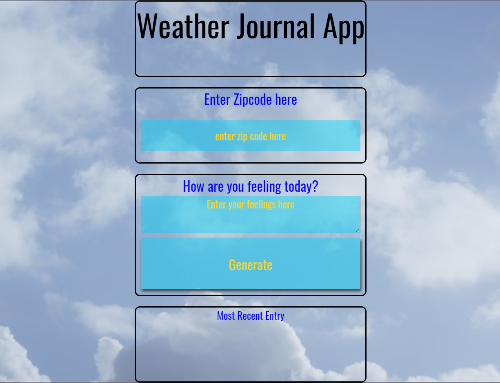

# FWD-Second-Project-Weather-Journal-App

This is a solution to the Second-Project task on FWD-UDACITY](https://egfwd.com/). 

## Table of contents

- [Overview](#overview)
  - [The Task](#the-Task)
  - [Screenshot](#screenshot)
  - [Links](#links)
- [My process](#my-process)
  - [Built with](#built-with)
  - [What I learned](#what-i-learned)
  - [Useful resources](#useful-resources)
- [Author](#author)

## Overview

### The Task

Create an asynchronous web app that uses Web API and user data to dynamically update the UI for a Weather-Journal App.
### Screenshot

### Links

- Live Site URL: [Weather-Journal-App](https://ahmedhll.github.io/Weather-Journal-App-FWD-Udacity/)

## My process

### Built with

- Semantic HTML5 markup
- CSS custom properties
- CSS Grid
- JavaScript 
-ES6 
-Node.js
### What I learned

- Setup a Node environment with Express and the necessary project dependencies.
- Setup a server with GET and POST routes.
- Create developer credentials for a Web API.
- Use the Fetch API with my credentials and user input to get dynamic data into my app routes.
- Access a GET route on the server side, from a function called on the client side.
- Chain Promises together.
- Access HTML elements with JavaScript and set their properties dynamically.

### Useful resources

- [webinar1-Web APIs & Asynchronous JS](https://udacity.zoom.us/rec/play/hZM9Mwo61aE_g-LrQ_ePuMTTtNJZvqTBWFc8NMAayUOaB1X1aKhyQMGUfpuzyNMVosEEwY_yJtdEoqJZ.gnTA-RZltMtEAhET?autoplay=true&startTime=1617215231000&fbclid=IwAR2QXQ3Fyiws20pCyG86rmwIUJ3U96KXzFKAXSkQF3Z5kJ8t7ZquvLS03ag).
- [webinar2-Weather App - Project Walkthrough](https://udacity.zoom.us/rec/play/FYD8mT7M-SgzsMQwmIzaZKCShh45L_4IqUHlcBEfGm2GztelDaMRPTT_J9M1xYOXbgApMFtgJVz4R6nZ.PvQ9uuEGf-bZhG9q?autoplay=true&startTime=1620676807000&fbclid=IwAR1gSoH2l5ub8zL7KslbjheIM9PSOQhUHeMiGlPWFdW73DbHxZRaWEfp3sY).
- [FWD online community](https://nfpdiscussions.udacity.com/c/questions-hub/web-professional-questions-hub/85).
## Author

- web professional - [@AhmedHall](https://nfpdiscussions.udacity.com/u/ahmedhall/summary)
